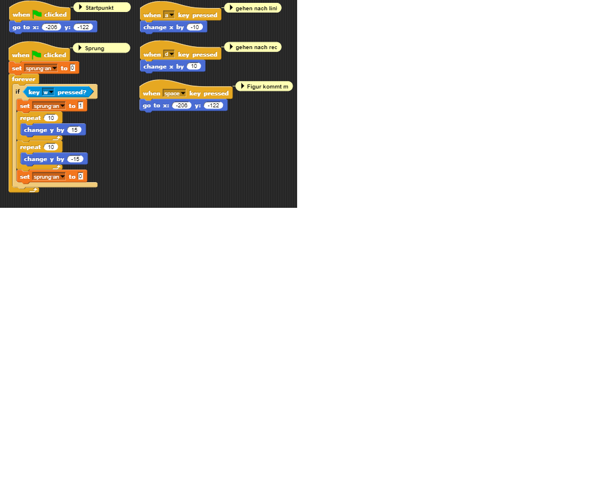
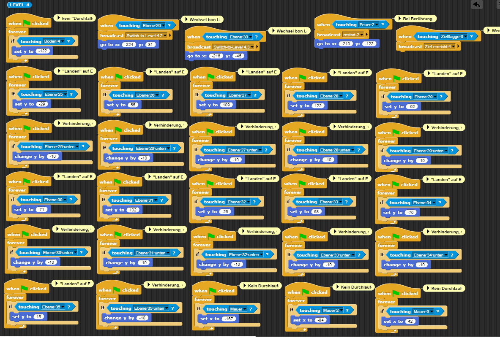

<h1 id="Projektseite">

<h1 id="kapitel3">3. Projektseite</h1>
  
### Inhaltsverzeichnis
<li><a href="#kapitel3.1">Programme</a></h2></li>
<li><a href="#kapitel3.2">Idee</a></h2></li>
<li><a href="#kapitel3.3">Ergebnis</a></h2></li>
<li><a href="#kapitel3.4">Fazit</a></h2></li>
  
<h2 id="kapitel3.1">Programme</h2>

Für unser Projekt haben wir "Snap!" genutzt, da dieses Programm gerade für Anfänger sehr gut geeignet und einfach zu verstehen ist. Bei "Snap!" wird keine "Programmiersprache" genutzt, sondern Bausteine, auf denen in Englisch steht, was passieren soll, wenn sie zusammengesetzt werden. Für Anfänger ist gerade dies von Vorteil, da man sich nicht erst in die "Programmiersprache" einarbeiten muss, sondern direkt anfangen kann und die Herausforderung "nur" ist, die Bausteine richtig zu kombinieren, um den gewünschten Befehl auszuführen. Wir mussten feststellen, dass es trotz dieser Vereinfacherung gar nicht so einfach ist, immer die richtigen Blöcke zukombinieren, um das gewünschte Ergebnis zu erzielen, jedoch haben wir immer eine Lösung gefunden und konnten weiterarbeiten und unsere Ideen umsetzten.

Für die äußere Gestaltung haben wir uns mit dem Pixelzeichner "pixilart" beschäftigt und sind mit diesem sehr gut zurecht gekommen. Es handelt sich bei diesem Pixelzeichner um einen kostenlosen Onlinezeichner, der sehr einfach zu verstehen ist, weshalb wir schnell und ohne große Einarbeitung erste Ergebnisse erzielen konnten.

Für die Musik in unserem 2D-Spiel hat Bente sich zusammen mit ihrem Bruder mit "FL-Studio" beschäftigt. FL-Studio ist eine "Digital Audio Workstation", was bedeutet, dass Audiosignale erzeugt und bearbeitet werden können. Hauptsächlich wird diese "Workstation" für die Musikproduktion, das Mixing und Mastering von Musik verwendet.

<h2 id="kapitel3.2">Idee</h2>
Unsere Grundidee basiert auf einem "Jump and Run"-Spiel, in welchem eine Figur in mehreren Leveln Hindernisse überwinden und zum Ziel gelangen muss. Hierbei ist es uns wichtig, dass die Figur weder von unten durch die Hindernisse hindurch darauf springen kann, noch von einem Hindernis zum nächsten Hindrnis in der Luft laufen kann. Es muss also eine Schwerkraft oder Gravitationskraft erstellt werden, genauso wie undurchdringbare Hindernisse.

verworfene Ideen

  
- 2D-Spiel: Labyrinth -> Tierpaare müssen sich gegenseitig finden 

- 2D-Spiel: Irrgarten -> farbige Kugel müssen durch ein Wirrwarr von Wegen den richtigen Weg in das Rohr ihrer eigenen Farbe finden

<h2 id="kapitel3.3">Ergebnis</h2>
Unser 2D-Spiel ist ein "Jump and Run"-Spiel mit vier verschiedenen Leveln geworden. Pro Level kommt ein neues Element hinzu, welches das Level anspruchsvoller und spannnender gestalten soll.
So ist im ersten Level das Ziel, die Zielflagge zu erreichen, in dem man von Hindernis zu Hindernis springt, was im ersten Moment noch nicht allzu schwierig erscheint. Im zweiten Level dann, haben wir noch ein Feuer eingebaut, in welchem die Figur "verbrennt", sobald sie es berührt und das Level von vorne beginnen muss. Im dritten Level ist das Ziel zwei Münzen einzusammeln, wobei wir drei Münzen eingebaut haben, damit man mehrere Kombinationsmöglichkeiten hat. Sind die zwei Münzen eingesammelt ist das Level geschafft und man wird weiter geleitet. Im vierten und letzten Level dann, muss die Figur über Mauern springen, um ans Ziel zu gelangen, wobei wir auch hier ein Feuer eingebaut haben, welches die Figur, sobald sie es brührt, zwingt von vorne zu beginnen.
Das Thema unseres 2D-Spiels ist "Dschungel", Level 1 bis 3 stellen hierbei den Dschungel mit Lianen und viel grün dar und Level 4 das Ende des Dschungels, da schon erste Mauern zu finden sind und auf den Felsen (Ebenen) nur noch ein bisschen Moos wächst und keine Lianen mehr hängen.

Erklärung Ergebnis

Erklärung Figur

Unsere Figur bewegt sich, indem man sie mit den Tasten "a", "d" und "w" steuert. Mit der "d"-Taste geht die Figur nach vorne, mit der "a"-Taste wieder zurück und drückt man die "w"-Taste, springt unsere Figur, dabei ist "15" die Höhe und Geschwindigkeit, die unsere Figur springt bzw "-15" die, die sie fällt. Die Variable "sprung an" signalisiert userer Figur, dass sie nun springen muss. Am Anfang jedes Levels muss man die "space"-Taste drücken, damit sich die Figur auf ihre festgelegte Startposition begibt, welche sich bei x: -206 y:-122 befindet.

Erklärung Musik

Die Musik in unserem Spiel haben Bente und ihr Bruder mithilfe von "FL-Studio" erstellt. Wenn unser Spiel beginnt, fängt zunächst der "Startsound" an sich abzuspielen, wählt man nun ein Level aus und klickt den "Levelbutton", wir "play-Gamesound" vom jeweiligen "Levelbutton" gebroadcastet und der Sound wechselt zum "Gamesound". Erreicht man nun in den einzelnen Level das Ziel, wechselt der Sound wieder zum "Startsound" mit dem Wechsel zur "Stage" mit dem "zurück zur Levelauswahl"-Button und ein neuer Broadcast signalisiert den Wechsel. Dieser Broadcast ist der selbe, wie der, der die einzelnen Level beendet (Erklärung siehe "Erklärung Level 1").
  

Erklärung allgemeine Befehle

Für den Startbildschirm, welcher den Beginn unseres 2D-Spiels darstellt, haben wir zunächst ein eigenes "Stage Costume" erstellt und danach eigene "Blocks", welche die einzelnen "Sprites" der jeweiligen "Stage Costumes" "hiden" oder "shown", wobei für den Startbildschirm alles "gehidet" werden muss außer das was zum Startbildschirm dazugehört. Klickt man nun den Startknopf wird "StartGame" gebroadcastet, was zum Wechsel zum "Costume" "Levelauswahl" führt, wo erneut alle Elemente außer die "gehidet" werden müssen, welche für diesen Bildschirm wichtig sind. 
Nachdem man ein Level beendet hat, gelangt man zum "Stage Costume" "Level ... geschafft", wo ebenfalls durch einen "Knopf" ein Broadcast verbreitet wird ("zurück zur Levelauswahl"), welcher das "Stage Costume" zurück in das der Levelauswahl ändert.
  

Erklärung Level 1

Um Level 1 zu starten, muss zunächst der Levelbutton 1 geklickt werden, welcher daraufhin "Start-Level-1" broadcastet und zum "Stage Costume" Level 1 wechselt. Hier kommen dann wieder unsere "Blocks" zum Einsatz, die alles "hiden", was nicht zum Level 1.1 gehört. Durch das Bewegen der Figur (siehe Erklärung Figur) gelangt man von Hindernis zu Hindernis und sobald man Ebene 3 erreicht, wird "Switch-to-Level 1.2" gebroadcastet und das "Stage Costume" wird zu Level 1.2 geändert und nun alle Elemente "gehidet", die nicht zum Level 1.2 gehören. Berührt die Figur nun die Zielflagge, wird "Ziel-erreicht" gebroadcastet und das "Costume" zu "Level-1-geschafft" geändert. Von dort gelangt man zurück zur Levelauswahl und kann die nächsten Level spielen (siehe Erklärung allgemeine Befehle).
  

  

Erklärung Level 2

Erklärung Level 3

Erklärung Level 4

<h2 id="kapitel3.4">Fazit</h2>
Am Ende dieses sehr zeitaufwändigen und umfangreichen Projekt, können wir sagen, dass es trotz vieler Schwierigkeiten und so einigen Problemen, für die wir zum Glück alle eine Lösung gefunden haben, sehr viel Spaß gemacht hat etwas eigenes zu programmieren und am Ende dann auch ein Ergebnis vor Augen zu haben, mit dem wir sehr zufrieden sind. Denn dafür, dass wir beide vorher noch nie etwas programmiert haben, geschweige denn Vorkenntnisse hatten, sind wir sehr stolz darauf, dass wir unser eigenes 2D-Spiel programmiert haben und doch mehr umsetzen konnten, als wir uns am Anfang zugetraut haben.
Unserer Meinung nach war der Informatikunterricht immer eine schöne Abwechslung zum Frontalunterricht, den man die restliche Woche über hat. Am Anfang war es zwar schwer, ganz ohne Imput und konkrete Vorgaben etwas zu finden, was man machen könnte, jedoch sind wir im Nachhinein froh darüber, dass wir unser eigenen Kreativität freien Lauf lassen konnten und tatsächlich überwiegend eigenständig arbeiten konnten. 
